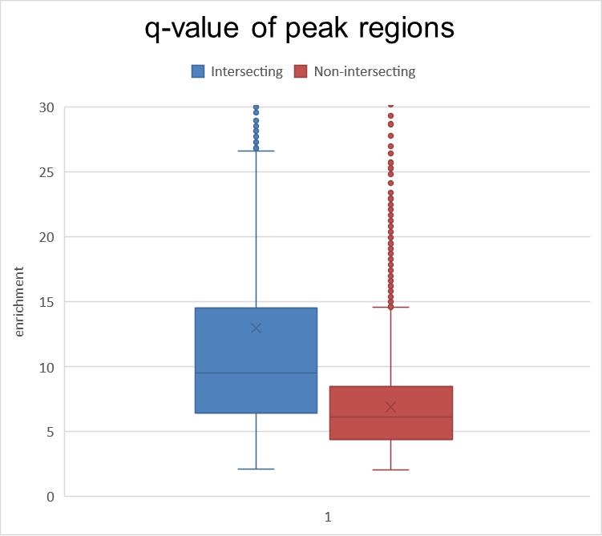

# ChIP-seq Analysis Tutorial

# 1. **Getting Started**

## Introduction

ChIP-seq analysis is a powerful technique used to identify protein-DNA interactions and determine the locations of transcription factor binding sites and histone modifications. This tutorial provides a step-by-step guide to analyzing ChIP-seq data using the MACS2 peak calling algorithm and other tools. It includes instructions for downloading data from the ENCODE project, quality control, peak calling, and downstream analysis. By following this tutorial, you will learn how to perform a thorough analysis of ChIP-seq data and gain insights into gene regulation and chromatin dynamics.

## Select your gene (ATF6)

ATF6 is a transcription factor that plays an important role in the unfolded protein response (UPR) pathway. When unfolded or misfolded proteins accumulate in the endoplasmic reticulum, ATF6 is activated and translocates to the nucleus, where it binds to DNA and activates the expression of genes involved in protein folding and degradation. Dysfunction of the UPR pathway and ATF6 has been implicated in various diseases, including cancer, neurodegenerative disorders, and diabetes. This is the gene we will be using for this tutorial. Download the experiment and controls from Encode using the following links.

**Encode page** with the experiment: [ENCSR769CWW](https://www.encodeproject.org/experiments/ENCSR769CWW/)

**Encode version**: ENCODE4 v1.4.0 GRCh38

**Encode controls:** [ENCSR239QGH](https://www.encodeproject.org/experiments/ENCSR239QGH/)

- If you want a deeper look at the topic you can check the following articles:
    
    [MACS2](https://hbctraining.github.io/Intro-to-ChIPseq/lessons/05_peak_calling_macs.html)
    
    [IDR](https://hbctraining.github.io/Intro-to-ChIPseq/lessons/07_handling-replicates-idr.html)
    
    [File formats](https://www.encodeproject.org/chip-seq/transcription_factor/)
    

## Downloads

A table containing the files we are going to use. "flt" refers to "Filtered," "unf" to "Unfiltered," "ctrl" to "Control," and "IDR" to "Irreproducibility Discovery Rate" (be sure to check the vignette at the beginning of the file if you don’t know what these are). The other files will be explained later.

| flt1 | flt2 | ctrl.flt | IDR1 | IDR2 |  |
| --- | --- | --- | --- | --- | --- |
| unf1 | unf2 | ctrl.unf | IDR12 | https://www.encodeproject.org/annotations/ENCSR738RTF/ (file https://www.encodeproject.org/files/ENCFF808IZE/) | https://www.encodeproject.org/files/ENCFF356LFX/ |
| https://www.encodeproject.org/reference-epigenomes/ENCSR888GEN/ | https://www.encodeproject.org/files/ENCFF439EIO/ |  |  |  |  |

## Tools

These are the tools that we’ll use.

- [GREAT](http://great.stanford.edu/public/html/)
- [PscanChIP](http://159.149.160.88/pscan_chip_dev/)
- [SeqMiner](https://www.france-genomique.org/seqminer/?lang=en)
- [JASPAR](https://jaspar.genereg.net/)

# 2. **Preliminary analysis**

We’ll see a couple of simple commands to retrieve information on our reads.

## Read length

To check the read length via Bash we use **samtools stats**:

```bash
samtools stats encode/unf1.bam | grep ^RL | cut -f 2- #-> 75
samtools stats encode/ctrl.flt.bam | grep ^RL | cut -f 2- #-> 76
```

## Flagstat

We can check the % of mapped reads (good ≥ 75%). We run flagstat on unf1, flt1, unf2, flt2. We can also run it on the controls. We save the stats on a .txt file.

```bash
samtools flagstat encode/unf1.bam > encode/stats/unf1.txt #-> total:36919776 mapped:34035037 (92.19%)
samtools flagstat encode/flt1.bam > encode/stats/flt1.txt #-> total:26267343 mapped:26267343 (100.00%) multiple-map: ( of mapping)
samtools flagstat encode/flt2.bam > encode/stats/flt2.txt #-> total:32238483 mapped:32238483 (100.00%) multiple-map: ( of mapping)
samtools flagstat encode/unf2.bam > encode/stats/unf2.txt #-> total:44965107 mapped:41778885 (92.91%)

samtools flagstat encode/ctrl.unf.bam > encode/stats/ctrl.unf.txt  
samtools flagstat encode/ctrl.flt.bam > encode/stats/ctrl.flt.txt 
```

# 3. Find and evaluate peaks

After checking that our reads are good we can proceed with the actual analysis. The first thing we need to do is transform our reads into something that gives us an idea of what our gene does.

## Peak calling

Peak calling is a computational method used in genomics to identify regions in the genome where specific biological events, such as protein-DNA interactions or histone modifications, are concentrated. It involves analyzing aligned sequencing reads to find regions with a higher density of reads compared to background noise. We want to call peaks of flt and unf of both replicate 1 and 2. We also want to use callpeak on the merged peaks of the two replicates. To do so, we can simply pass both replicates as input to the callpeak function (as shown in the code block). In total, we will use callpeak 6 times. We can choose an FDR that is permissive (0.05) or stringent (0.01) based on how many peaks we have. 

**IMPORTANT:** check in the log files that the 'Redundant rate' (RR) is less than 0.2. You can also check the estimated fragment size. 

- Peak calling list
    
    unf1 vs control unfiltered
    
    flt1 vs control filtered
    
    unf2 vs control unfiltered
    
    flt2 vs control filtered
    
    unf1 + unf2 vs control unfiltered
    
    flt1 + flt2 vs control filtered
    
- Macs2 code
    
    ```bash
    macs2 callpeak -t encode/unf1.bam -c encode/ctrl.unf.bam -g hs -q 0.01 --outdir unf_peaks -n unf1 2> unf_peaks/logs/peak.unf1.log #(RR: trt=0.04,  ctrl 0.06)(fr_sz=81)
    macs2 callpeak -t encode/unf2.bam -c encode/ctrl.unf.bam -g hs -q 0.01 --outdir unf_peaks -n unf2 2> unf_peaks/logs/peak.unf2.log #(RR: trt=0.06,  ctrl=0.06)(fr_sz=87)
    macs2 callpeak -t encode/flt1.bam -c encode/ctrl.flt.bam -g hs -q 0.01 --outdir flt_peaks -n flt1 2> flt_peaks/logs/peak.flt1.log #(RR: trt=0.00, ctrl=0.00)(fr_sz=126)
    macs2 callpeak -t encode/flt2.bam -c encode/ctrl.flt.bam -g hs -q 0.01 --outdir flt_peaks -n flt2 2> flt_peaks/logs/peak.flt2.log #(RR: trt=0.00,  ctrl=0.00)(fr_sz=127)
    
    # The following are the merged replicate. We put both replicate after -t. -c is what we are calling peaks against.
    macs2 callpeak -t encode/unf1.bam encode/unf2.bam -c encode/ctrl.unf.bam -g hs -q 0.01 --outdir unf_peaks -n mrg.unf 2> unf_peaks/logs/peak.mrg.unf.log #(RR: trt=0.06, ctrl=0.06)(fr_sz=87)
    macs2 callpeak -t encode/flt1.bam encode/flt2.bam -c encode/ctrl.flt.bam -g hs -q 0.01 --outdir flt_peaks -n mrg.flt 2> flt_peaks/logs/peak.mrg.flt.log #(RR: trt=0.01, ctrl=0.00)(fr_sz=118)
    ```
    

 Each macs2 call will generate an R file. Running that file will produce the fragment size plot.

- MACS2 read length
    
    tag size = 75 bps
    
    |  | unf1 | unf2 | mrg.unf | flt1 | flt2 | mrg.flt |
    | --- | --- | --- | --- | --- | --- | --- |
    | RR trt | 0.04 | 0.06 | 0.06 | 0.00 | 0.00 | 0.01 |
    | RR ctrl | 0.06 | 0.06 | 0.06 | 0.00 | 0.00 | 0.00 |
    | fr_sz | 81 | 87 | 87 | 126 | 127 | 118 |

In the output directory, we will find 2 important files: .narrowPeak and summits.bed. The first one contains the genomic coordinates of the extended regions identified by MACS, while the second one only the peak summit of each called peak. 

## Blacklisted regions

These are regions that we must remove from our peaks because they have low complexity, meaning they are aspecific  (read [blacklisted regions](https://www.encodeproject.org/files/ENCFF356LFX/)) (e.g.: GCGCGCGC). We can use 'bedtools intersect -v' between our narrowPeaks.bed files (or summits) and blacklist files to remove them.

Code to remove blacklisted regions:

- Remove from unfiltered files, both narrowPeaks and Summits
    
    ```bash
    # Remove blacklisted from unfiltered, both narrowPeaks and summits
    bedtools intersect -a unf_peaks/unf1_peaks.narrowPeak -b encode/blacklist.bed -v > unf_peaks/unf1.clean_peaks.narrowPeak
    bedtools intersect -a unf_peaks/unf1_summits.bed -b encode/blacklist.bed -v > unf_peaks/unf1.clean_summits.bed
    
    bedtools intersect -a unf_peaks/unf2_peaks.narrowPeak -b encode/blacklist.bed -v > unf_peaks/unf2.clean_peaks.narrowPeak
    bedtools intersect -a unf_peaks/unf2_summits.bed -b encode/blacklist.bed -v > unf_peaks/unf2.clean_summits.bed
    
    bedtools intersect -a unf_peaks/mrg.unf_peaks.narrowPeak -b encode/blacklist.bed -v > unf_peaks/mrg.unf.clean_peaks.narrowPeak
    bedtools intersect -a unf_peaks/mrg.unf_summits.bed -b encode/blacklist.bed -v > unf_peaks/mrg.unf.clean_summits.bed
    ```
    
- Remove from filtered, both narrowPeaks and Summits
    
    ```bash
    # Remove blacklisted from filtered, both narrowPeaks and summits
    bedtools intersect -a flt_peaks/flt1_peaks.narrowPeak -b encode/blacklist.bed -v > flt_peaks/flt1.clean_peaks.narrowPeak
    bedtools intersect -a flt_peaks/flt1_summits.bed -b encode/blacklist.bed -v > flt_peaks/flt1.clean_summits.bed
    
    bedtools intersect -a flt_peaks/flt2_peaks.narrowPeak -b encode/blacklist.bed -v > flt_peaks/flt2.clean_peaks.narrowPeak
    bedtools intersect -a flt_peaks/flt2_summits.bed -b encode/blacklist.bed -v > flt_peaks/flt2.clean_summits.bed
    
    bedtools intersect -a flt_peaks/mrg.flt_peaks.narrowPeak -b encode/blacklist.bed -v > flt_peaks/mrg.flt.clean_peaks.narrowPeak
    bedtools intersect -a flt_peaks/mrg.flt_summits.bed -b encode/blacklist.bed -v > flt_peaks/mrg.flt.clean_summits.bed
    ```
    

## Peaks count

Let's count the number of peaks in each file considering narrowPeak files. I’ve done both narrowPeak and summits to show you that they are the same. We can also do it on uncleaned peaks (peaks before removing blacklisted regions) to see how many peaks we removed. 

- Unclean Peak count
    
    ```bash
    wc -l dump_peaks/unf1_peaks.narrowPeak #-> 7400
    wc -l dump_peaks/unf1_summits.bed #-> 7400
    
    wc -l dump_peaks/flt1_peaks.narrowPeak #-> 5176
    wc -l dump_peaks/flt1_summits.bed #-> 5176
    
    wc -l dump_peaks/unf2_peaks.narrowPeak #-> 14075
    wc -l dump_peaks/unf2_summits.bed #-> 14075
    
    wc -l dump_peaks/flt2_peaks.narrowPeak #-> 11655
    wc -l dump_peaks/flt2_summits.bed #-> 11655
    
    wc -l dump_peaks/mrg.unf_peaks.narrowPeak #-> 27909
    wc -l dump_peaks/mrg.unf_summits.bed #-> 27909
    
    wc -l dump_peaks/mrg.flt_peaks.narrowPeak #-> 22995
    wc -l dump_peaks/mrg.flt_summits.bed #-> 22995
    ```
    
- Clean Peak count (in parentheses, the corresponding value for the non-clean file)
    
    ```bash
    wc -l unf_peaks/unf1.clean_peaks.narrowPeak #-> 7130 (7400) (-270)
    wc -l unf_peaks/unf1.clean_summits.bed #-> 7130 (7400)
    
    wc -l flt_peaks/flt1.clean_peaks.narrowPeak #-> 5147 (5176) (-29)
    wc -l flt_peaks/flt1.clean_summits.bed #-> 5147 (5176)
    
    wc -l unf_peaks/unf2.clean_peaks.narrowPeak #-> 13836 (14075) (-239)
    wc -l unf_peaks/unf2.clean_summits.bed #-> 13837 (14075)
    
    wc -l flt_peaks/flt2.clean_peaks.narrowPeak #-> 11625 (11655) (-30)
    wc -l flt_peaks/flt2.clean_summits.bed #-> 11625 (11655)
    
    wc -l unf_peaks/mrg.unf.clean_peaks.narrowPeak #-> 27712 (27909) (-197)
    wc -l unf_peaks/mrg.unf.clean_summits.bed #-> 27713 (27909)
    
    wc -l flt_peaks/mrg.flt.clean_peaks.narrowPeak #-> 22977 (22995) (-18)
    wc -l flt_peaks/mrg.flt.clean_summits.bed #-> 22977 (22995)
    
    # IDR
    wc -l encode/IDR12.bed #-> 5163
    ```
    

## Overlap

Now let's compare the replicates with each other to see how many summits they have in common (using only the clean ones). If possible, it's better to perform the overlap using the 'summits.bed' files. We decide to consider 2 summits as overlapping if they are located at a distance less than or equal to 100 bp.

- Summits to check
    
    unf1 vs flt1
    
    unf1 vs unf2
    
    unf2 vs flt2
    
    flt1 vs flt2
    
    unf1 vs mrg.unf
    
    unf2 vs mrg.unf
    
    flt1 vs mrg.flt
    
    flt2 vs mrg.flt
    
- Additional summits to check (optional)
    
    flt1 vs mrg.unf
    
    flt2 vs mrg.unf
    
    unf1 vs mrg.flt
    
    unf2 vs mrg.flt
    

```bash
bedtools closest -a unf_peaks/unf1.clean_summits.bed -b unf_peaks/unf2.clean_summits.bed -d | awk '$11<=100{c++} END{print c+0}' #-> 4215
bedtools closest -a flt_peaks/flt1.clean_summits.bed -b flt_peaks/flt2.clean_summits.bed -d | awk '$11<=100{c++} END{print c+0}' #-> 2853

bedtools closest -a unf_peaks/unf1.clean_summits.bed -b flt_peaks/flt1.clean_summits.bed -d | awk '$11<=100{c++} END{print c+0}' #-> 3927
bedtools closest -a unf_peaks/unf2.clean_summits.bed -b flt_peaks/flt2.clean_summits.bed -d | awk '$11<=100{c++} END{print c+0}' #-> 9000

bedtools closest -a unf_peaks/unf1.clean_summits.bed -b unf_peaks/mrg.unf.clean_summits.bed -d | awk '$11<=100{c++} END{print c+0}' #-> 6125 
bedtools closest -a unf_peaks/unf2.clean_summits.bed -b unf_peaks/mrg.unf.clean_summits.bed -d | awk '$11<=100{c++} END{print c+0}' #-> 11842

bedtools closest -a flt_peaks/flt1.clean_summits.bed -b flt_peaks/mrg.flt.clean_summits.bed -d | awk '$11<=100{c++} END{print c+0}' #-> 4364
bedtools closest -a flt_peaks/flt2.clean_summits.bed -b flt_peaks/mrg.flt.clean_summits.bed -d | awk '$11<=100{c++} END{print c+0}' #-> 9907
```

## Compare our results with ENCODE

We can find IDR files in the form of narrowPeaks.bed files containing the peak regions calculated by ENCODE. We can compare the peaks in the ENCODE file with the peaks obtained using MACS2. Remember to do all these steps with the filtered data. The encode file with the peaks is on the same page as my gene, under "file detail", after filtering for bigBedNarrowpeak (the only one with the asterisk). If you need additional information on IDR check the following resources: [handling replicates](https://hbctraining.github.io/Intro-to-ChIPseq/lessons/07_handling-replicates-idr.html), [nboley](https://github.com/nboley/idr)

Considering only the 'mrg.flt' file produced by MACS2, overlap it with the ENCODE peaks (IDR12 file) (use gunzip on the ENCODE files to decompress them on from the command line). In this case, since the ENCODE files are not 'summits.bed', the overlap must be done considering the peak regions (narrowPeaks files).

- List of possible intersection
    1. mrg.flt vs IDR12
    2. flt1 vs IDR1 
    3. flt2 vs IDR2
    4. flt1 vs IDR12
    5. flt2 vs IDR12
    6. overlap_intersect(flt1 vs flt2) vs IDR12

Since IDR12.bed files are genomic regions, I will perform the intersection with my clean narrowPeaks.

```bash
bedtools intersect -a flt_peaks/mrg.flt.clean_peaks.narrowPeak -b encode/IDR12.bed | wc -l #-> 4669 
bedtools intersect -a flt_peaks/flt1.clean_peaks.narrowPeak -b encode/IDR12.bed | wc -l #-> 2207
bedtools intersect -a flt_peaks/flt2.clean_peaks.narrowPeak -b encode/IDR12.bed | wc -l #-> 3452

bedtools intersect -a flt_peaks/flt1.clean_peaks.narrowPeak -b flt_peaks/flt2.clean_peaks.narrowPeak | bedtools intersect -a - -b encode/IDR12.bed | wc -l #-> 1944
```

How many peaks are found only in our files and how many only in ENCODE files? To answer, fill out the table below (file peak count - shared). Shared = number of peaks shared by both files (obtained with bedtools intersect, IDR paragraph).

|  | only file1 | shared | only file2 |
| --- | --- | --- | --- |
| mrg.flt VS IDR12 | 22977-4669 = 18.308 | 4669 | 5163-4669 = 494 |
| flt1 VS IDR12 | 5147-2207 = 2.940 | 2207 | 5163-2207 = 2.956 |
| flt2 VS IDR12 | 11625-3452 = 8.173 | 3452 | 5163-3452 = 1.711 |
| overlap_intersect | 3735-1944 = 1.791 | 1944 | 5163-1944 = 3.219 |
| myIDR vs IDR12 | 2557-1309 = 1.248 | 1309 | 5163-1309 = 3.854 |
| downsampled vs IDR12 | 5597-2211 = 3.386 | 2211 | 5163-2211 = 2.952 |

> **N.B**: You might have noticed a “myIDR” in the first column. In the next section I’ll show you how you can make it.
> 

Now we obtain the column of q-values (overlapping and non-overlapping) of the various previously seen intersects, and then boxplot them, confirming that non-overlapping peaks have a lower mean enrichment value.

- Compare intersecting and non-intersecting qvalues
    
    First, I create a file with only those that intersect (using -wa), then one with those that do not intersect (using -v).
    
    ```bash
    # Merged vs IDR12
    bedtools intersect -a flt_peaks/mrg.flt.clean_peaks.narrowPeak -b encode/IDR12.bed -wa | awk '{print $9}' > flt_peaks/enr.mrg.IDR12.csv
    bedtools intersect -a flt_peaks/mrg.flt.clean_peaks.narrowPeak -b encode/IDR12.bed -v | awk '{print $9}' > flt_peaks/not.enr.mrg.IDR12.csv
    ```
    
    Now we use Rstudio to import them and make them two columns in a single Excel file.
    
    ```bash
    setwd("C:/Users/armgi/OneDrive/Desktop")
    table1 = read.csv("enr.mrg.IDR12.csv", header=FALSE)
    table2 = read.csv("not.enr.mrg.IDR12.csv", header=FALSE)
    library(qpcR)
    table_final <- qpcR:::cbind.na(table1, table2)
    library(openxlsx)
    # Così crea un file chiamate "mrg.IDR12.xlsx" nella working dir. 
    # Puoi inserire prima un path diverso volendo.
    write.xlsx(table_final, "mrg.IDR12.xlsx", asTable = FALSE, overwrite = FALSE)
    ```
    
    
    
    Boxplot with enrichment of filtered merged vs IDR
    

## Creating our IDR files and overlap with ENCODE IDR

As promised, we will now see how to create our own IDR files using the same parameters used by ENCODE, and then compare them with the ENCODE IDR files (we will use the 'idr' command on the server). To do this, we need to first obtain new peaks with MACS2, using less stringent parameters (FDR=0.1), because the 'idr' command is very stringent and needs to be run with a threshold of 0.2. We will only use the filtered bam files.

- Step-by-step code
    
    ```bash
    # call less stringent peaks ✔️
    macs2 callpeak -t encode/flt1.bam -c encode/ctrl.flt.bam -g hs -n myIDR1 --outdir my_idr/ -q 0.1  2> my_idr/logs/myIDR1.log
    macs2 callpeak -t encode/flt2.bam -c encode/ctrl.flt.bam -g hs -n myIDR2 --outdir my_idr/ -q 0.1  2> my_idr/logs/myIDR2.log
    
    # Clean blacklisted peaks
    bedtools intersect -a my_idr/myIDR1_peaks.narrowPeak -b encode/blacklist.bed -v > my_idr/myIDR1.clean_peaks.narrowPeak
    bedtools intersect -a my_idr/myIDR2_peaks.narrowPeak -b encode/blacklist.bed -v > my_idr/myIDR2.clean_peaks.narrowPeak
    
    #Sort peaks by -log10(p-value) ✔️
    sort -nk9 my_idr/myIDR1.clean_peaks.narrowPeak > my_idr/myIDR1.clean_peaks.narrowPeak2 ; mv my_idr/myIDR1.clean_peaks.narrowPeak2 my_idr/myIDR1.clean_peaks.narrowPeak
    sort -nk9 my_idr/myIDR2.clean_peaks.narrowPeak > my_idr/myIDR2.clean_peaks.narrowPeak2 ; mv my_idr/myIDR2.clean_peaks.narrowPeak2 my_idr/myIDR2.clean_peaks.narrowPeak
    
    # create our IDR file ✔️
    idr -s my_idr/myIDR1.clean_peaks.narrowPeak my_idr/myIDR2.clean_peaks.narrowPeak -i 0.2 -o my_idr/myIDR12_clean #--plot
    ### OUTPUT ###
    #Initial parameter values: [0.10 1.00 0.20 0.50]
    #Final parameter values: [0.42 1.15 0.69 0.56]
    #Number of reported peaks - 2557/9382 (27.3%)
    #Number of peaks passing IDR cutoff of 0.2 - 2557/9382 (27.3%)
    ```
    
    ```bash
    # Merged vs IDR12
    bedtools intersect -a my_idr/myIDR12_clean -b encode/IDR12.bed -wa | awk '{print $7}' > flt_peaks/enr.mrg.IDR12.csv
    bedtools intersect -a my_idr/myIDR12_clean -b encode/IDR12.bed -v | awk '{print $7}' > flt_peaks/not.enr.mrg.IDR12.csv
    
    ```
    
- Create .csv with intersections for boxplot visualization as before
    
    ```bash
    # prova:
    bedtools intersect -a my_idr/myIDR12_clean -b encode/IDR12.bed -wa | awk '{print $7}' > my_idr/myIDR.IDR12.csv
    bedtools intersect -a my_idr/myIDR12_clean -b encode/IDR12.bed -v | awk '{print $7}' | paste my_idr/myIDR.IDR12.csv - > my_idr/myIDR.IDR12.final.csv ; mv my_idr/myIDR.IDR12.final.csv my_idr/myIDR.IDR12.csv
    ```
    

**Q1:** How many peaks do we obtain using the same IDR threshold as ENCODE?

**Q2:** What is the overlap between these peaks and ENCODE's peaks?

- **Answers:**
    
    ```bash
    #Q1 ✔️
    wc -l my_idr/myIDR12_clean  # 2557
    #Q2 ✔️
    bedtools intersect -a my_idr/myIDR12_clean -b encode/IDR12.bed | wc -l # 1309
    ```
    

## Choose best peaks

We created a lot of different peaks sets but we need to choose one to carry on our analysis. There are different criterions on how to do so. For example, we can choose the peak set with the smallest peak count among:

1. one of the two replicates
2. the intersection of the peaks of the two replicates
3. peaks obtained from the pooled/merged bam
4. peaks obtained by IDR
- To create **n.2** we can use the following code:
    
    ```bash
    bedtools intersect -a flt_peaks/flt1.clean_peaks.narrowPeak -b flt_peaks/flt2.clean_peaks.narrowPeak > flt_peaks/intersect12_clean.narrowPeak 
    wc -l flt_peaks/intersect12_clean.narrowPeak #-> 3735
    #  We can do the same for the summits using bedtools window
    bedtools window -a flt_peaks/flt1.clean_summits.bed -b flt_peaks/flt2.clean_summits.bed -w 100 -u > flt_peaks/intersect12.clean_summits.bed
    wc -l flt_peaks/intersect12.clean_summits.bed
    ```
    

Once we decided which is the best narrowPeak set we can display it on the UCSC genome browser.

For now, I choose (2), "the intersection of the peaks of the two replicates".

- **IMPORTANT: if you want to use myIDR file read here** (if you haven't chosen myIDR as the best peak set, skip this part):
    
    Since UCSC expects a narrowPeak format, if you use the file created by idr, which has double the number of columns (20 instead of 10), an error will occur. We can cut and keep only the first 10 columns with:
    
    ```bash
    awk '{print $1,$2,$3,$4,$5,$6,$7,$8,$9,$10}' my_idr/myIDR12_clean > my_idr/myIDR12_cut.clean
    ```
    

## Visualization

Go to the ENCODE page of your experiment, click on Visualize (on File Details) and the UCSC genome browser opens. By default, there is the ENCODE track, to add your own you need to do "add custom track" and put your chosen narrowPeak. If it gives an error, it's because you need to add a header to the file that does NOT contain tabs, like:

`track type=narrowPeak name="ATF6 narrowPeak" description="ATF6 narrowPeaks obtained using intersection of the 2 filtered replicates"`

Our track in this case will be displayed on the genome browser with the name "ATF6 narrowPeak". To view the untrimmed peaks on the genome browser (for track proteinfolding), right-click on the peak, "configure pool fold change", set track height=64 and data view=auto-scale to data view.

Now we need to find the peaks shared by encode and our experiment, those exclusive to one and exclusive to the other.

- Images with intersect12
    
    
    
    Common peak between intersect and IDR
    
    
    
    Intersect exclusive peak
    

**In addition**, we can activate the track "Jaspar Transcription Factors" (2020) and select our protein under "Filter by Name of item". In this way, if one of our peaks is not on the ENCODE track, but is on Jaspar's, we can rest assured that it is probably still fine.

## Check reference epigenome

On the control page, we have the "Reference Epigenome". It contains the results of all experiments performed on the HepG2 cell line for the characterization of the epigenome. Also, the "chromHMM" chromatin status annotation can be found here: [https://www.encodeproject.org/annotations/ENCSR738RTF/](https://www.encodeproject.org/annotations/ENCSR738RTF/) . The reference epigenome for our reference genome is here (below file details, bed9 and GRCh38).

# 4. Find chromatin state and target genes

## Find chromatin states (seqMiner)

chromHMM contains all the different chromatin state annotations in a single file. Each row is a DNA region with its epigenomic regulation. So if we make an intersection between the file with the annotations and one of our summits, we obtain, for each summit, the corresponding chromatin state. In reality, it is more about the function of the chromatin region than "chromatin state".

We want to extract the chromatin state of all our peaks; let's make an intersect between the summit of our best peak set (I recommend the SUMMIT, not narrowPeak) and the chromHMM .bed.

```bash
bedtools intersect -a flt_peaks/intersect12.clean_summits.bed -b encode/chromHMM_HepG2.bed -wa -wb | awk '{print $9}' > cromHMM_intersect_visualize.csv
```

This command saves us the column with the chromatin status for each peak; we can put the .csv in excel and view the percentages of each chrom state there. To make the histogram in Excel, enter a name for the first cell, select the whole column, go to Insert > Recommended Pivot Tables and a table will be created with the frequencies of each chrom state. Now you can calculate the frequencies (eg =B4/B$22) and plot the histogram.

- Example of histogram
    
    
    

We choose the most present chrom state (TssA in our case) and search from the literature what is the histone modification most commonly associated with this state ([H3K27ac](https://en.wikipedia.org/wiki/H3K27ac) or [H3K9ac](https://en.wikipedia.org/wiki/H3K9ac), article [link for reference](https://www.nature.com/articles/nature14310)). 

We plot the distribution of this histone modification in the regions adjacent to our summits. To do this we need to download the .bam Reference Epigenome with the mapping of the histone modifications we are interested in.

- For example if I choose the modification H3K27ac:
    
    
    

Then we go to Seq-Miner and give it our summits, the .bam with the histone modification and (I think) the name of our protein.

- SeqMINER steps-by-step guide
    
    Open seqminer. In the 'Density array method' window > Step1: in the topmost 'browse' load the .bed file of your peaks, in the bottom 'browse' load your annotations (hist modification, Pol etc..) in .bam/ format .bed. Now click on 'load files', then 'extract data' and finally on 'clustering' choosing the clustering normalization that makes your data look better. The clustering result changes every time you run it, so if you see an image that you like save it.
    

Additionally, if our protein is part of a protein complex, we also need to give it the names of the other proteins in the complex.

- Output example of Seq-Miner
    
    
    
- Now we have to group the various chrom states of the previous .csv file by type (eg: Tss, Enh, etc..) and show the results through a pie chart.
    
    
    
- Theory check. Can you answer the following questions?
    1. What are the main histone modifications associated with each chrom state?
    2. Are you able to explain how chromHMM works?
    3. Do you know how to explain which chromatin states you should find associated with a TF-binding DNA?
    4. Did we find "strange" (w.r.t to a Transcriptional Factor) chromatin states in our peaks?

### Downsampled files (optional)

In some cases, the control page recommends using a "downsampled" version of the controls. The downsampled file is always already filtered.

1. How many reads are in the original and downsampled .bam file?
    1. Original:  samtools flagstat control_data/control_align.bam → 
    2. Downsampled:  samtools flagstat downsampled_control/ENCFF567ZWW.bam → 
2. Do we get relevant differences by using the downsampled instead of the original file?

## Crossing with another assay

Let's choose another assay, let's say ATAC-seq; it is an assay to see the accessibility of the DNA. We download it from the Reference Epigenome page (you can find it among the notion downloads) and we make bedtools intersect with our summits. We want to see how many of the summits are accessible. Let's plot with a pie chart the percentage of overlapping and non-overlapping summits with the other feature.

- Code using intersect12
    
    ```bash
    # I use the intersection of summits (1 and 2) (98.1% of regions overlap with accessible regions)
    bedtools intersect -a flt_peaks/intersect12.clean_summits.bed -b encode/ATACseq.bed -wa | sort | uniq | wc -l #-> 2798
    bedtools intersect -a flt_peaks/intersect12.clean_summits.bed -b encode/ATACseq.bed -v | sort | uniq | wc -l #-> 55
    ```
    

**Q1: Does your TF bind where it should (ex: accessible DNA regions)? Yes.**

**Q2: Why are some peaks in inaccessible regions? There are so few that it's probably noise.**

I advise you to learn the basic principles of as many analysis essays as you can (ATAC-Seq, DNAse-Seq, FAIRE-Seq, BS-seq, etc.)

## Determine the target genes of my TF with GREAT

[GREAT](http://great.stanford.edu/public/html/) assigns biological significance to a set of non-coding genomic regions by analyzing the annotations of neighbouring genes. We can use the "30K nearest neighbour rule"; to do this, click "show more" and put "1" instead of "5" in the first option and "30kb" instead of "1000.0kb". The .bed file produced by MACS2 has an error. We need to cut and leave only the first 4 columns. We can do this with awk:

```bash
awk '{print $1,$2,$3,$4}' flt_peaks/intersect12.clean_summits.bed > intersect12_4cut.clean.bed
```

**N.B. Always remember to input the summits**, not the whole peak regions

- GREAT output con intersect
    
    
    
    
    

It might be interesting to see the output under "Phenotype".

If we have too many peaks and GREAT doesn't accept the summits file, we can pass it a file with only the best peaks (according to their q-value). How many? Around 5000 or 10000. If we give it too many peaks, however, the functional annotations we get may not be relevant. Same thing though if our TF is a general transcription factor because it doesn’t bind a specific set of genes.

**Answer the following questions.** Considering the output of GREAT with intersect12 summits:

Q1: How many promoters of different genes are bound by our TF? (2094)

Q2: How many distal promoters (enhancers) of different genes are bound by our TF? (71)

Q3: What is the most enriched functional annotation?

Q4: Can you get the list of target gene IDs and distances of your binding site from their TSS? (I think it can be done by going under **"Job Description"** on the results page)

- The theory you should also know:
    
    How are the p-values associated with functional enrichment calculated by GREAT? One is the usual Fisher's test, but is there another one?". This information should be in the documentation of GREAT ([help page](https://great-help.atlassian.net/wiki/spaces/GREAT/pages/655456/Statistics)).
    
- Clicking on "[View all genomic region-gene associations](http://great.stanford.edu/public/cgi-bin/showAllDetails.php?species=hg38&sessionName=20211206-public-4.0.4-xFmeoe&foreName=myIDR1_3cut.clean.bed)" the page below opens:
    
    
    
    In the table on the left, we see the associated gene for each peak in our file and its distance from the peak. In the table on the right, however, we have all the genes found, alongside which peaks are associated and at what distance (basically the opposite of the table on the left).
    

## Studying binding specificity

We have the peaks where we find our TF and the surrounding regions of about 100bp, but we know that the nucleotides bound by TF are much less. How exactly do we find consensus? The first thing is to collect possible binding regions through:

- Literature mining
- In vitro large-scale screenings (e.g. SELEX)
- In vivo large-scale screenings (e.g. ChIP-Seq)

Then through an algorithm, you calculate the probability that each nucleotide is in a certain position. It is important to remember that the binding is not only influenced by the sequence of bases:

- E.g. factors influencing TF binding
    
    
    

This may explain why even if our TF binds a certain DNA motif (e.g. CCAAT) we do not find all the DNA regions enriched with that motif. In theory, however, all our enriched regions should contain at least once the binding motif of our TF near the summit (apart from perhaps some false positive regions) or at least similar motifs. The procedure described above is "de novo", we don't need to do this (in the next chapter we'll see how to do it).

### Finding binding motifs

You can look it up in the database [JASPAR](https://jaspar.genereg.net/). Insert the TF and it finds you the possible binding motifs. In my case, the result is [here](https://jaspar.genereg.net/matrix/MA1466.1/).

### Assess enrichment for a known motif

Now that we know from JASPAR the motif of our TF, we want to try to see if in our peaks that motif is enriched with respect to all the other motifs present in the JASPAR database. This is a type of "quality control".


- The most enriched motif should be the one associated with our TF and other TFs that bind DNA together with ours (and their peaks/sums should overlap)
- Candidate binding sites are also pre-loaded into a UCSC genome browser track

### PscanChip

[PscanChip](http://159.149.160.88/pscan_chip_dev/) takes as input a set of regions from the Chip-Seq (the summits) and all the descriptors (the motifs) known in the JASPAR dataset and evaluates the enrichment of the various motifs (using the sliding motif method). In the background, if it is possible select our cell line (otherwise put "mixed").

In the PscanChip output, we want the first results to be our TFs. Between the different columns, there is **G.PV** (global p-value), which is the p-value of the enrichment. Considering one JASPAR binding motif at a time, G.PV is related to the probability of finding it more in my regions than in the rest of the genome. **L.PV** is instead local p-value: it evaluates if I find a good instance of the binding site within the region with respect to the flanking ones.

- G.PV (global p-value): the lower it is, the more the motif is found in our regions and not in the rest of the genome. It is calculated with a 2-tail T-test.
- L.PV (local p-value): the lower it is, the closer the motif tends to be to the summit

You can find the output of Pscan-Chip run with HepG2, Jaspar2018NR here:

[](https://s3-us-west-2.amazonaws.com/secure.notion-static.com/c6cda42b-901c-49c6-bd00-37a64a45d00d/Pscan-Chip_intersect12.txt)


